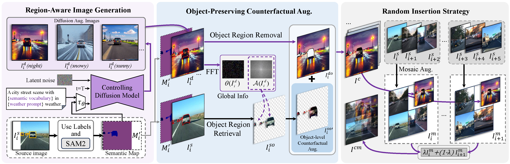

<p align="center">

  <h1 align="left">Object-Preserving Counterfactual Diffusion Augmentation for Single-Domain Generalized Object Detection (ACM MM 2025)</h1>
</p>

[](https://dl.acm.org/doi/pdf/10.1145/3746027.3754959)

## Please read this before using the repository
The implementation of our method consists of three stages. The first stage uses a pre-trained semantic segmentation model to obtain instance masks from the annotated object detection training set (this code corresponds to the complete version of this stage). The second stage generates content based on masks and prompts, and performs counterfactual augmentation using the masks (this stage is carried out during the LDM generation process). The third stage applies random insertion augmentation during the data augmentation phase prior to detector training.

## Framework


## Prepare the dataset
Download and prepare the dataset required for the experiments. Update the dataset path in the configuration file.
### Dataset
* **Normal to adverse weather:** Please follow the [instruction](https://sites.google.com/site/boyilics/website-builder/reside) to prepare dataset.
* **Real to artistic:** Please follow the [instruction](https://github.com/naoto0804/cross-domain-detection/tree/master/datasets) to prepare dataset.
* **Normal to corruption:** Please follow the [instruction](https://github.com/bethgelab/robust-detection-benchmark) to prepare dataset.
You can also directly generate the results using the code provided in this repository:
```shell
cd imagecorruptions
pip install -r requirements.txt
python imagecorruptions.py
```


## Step 1: Mask acquisition
Here we provide the code implementation based on SAM, and migrating it to SAM2 requires only minor modifications. For deploying the SAM environment, please refer to the official documentation [INSTALL.md](seg-req/INSTALL.md) and download the checkpoint [ViT-B SAM model](https://dl.fbaipublicfiles.com/segment_anything/sam_vit_b_01ec64.pth).
```shell
# Generation of instance-level segmentation masks
# Before proceeding, all annotations are converted to the YOLO format.
python object_mask.py
```

## Step 2: Content generation
Using prompts and masks, diverse content is generated through the RIG module, or through other similar generation methods such as [DGInStyle](https://github.com/prs-eth/DGInStyle) or [DIDEX](https://github.com/JNiemeijer/DIDEX). Then, the OCA module is applied to perform frequency-domain style fusion.
```shell
# Prepare the generated images, the corresponding masks, and the original images. Here, we provide an example in which four images are concatenated together.
python OCA.py
```

## Step 3: Random insertion augmentation
The images generated in the previous two steps are randomly mixed with the original images to form training data for different detectors. It should be noted that the random mixing must be performed during the data augmentation stage; performing the mixing beforehand and feeding it directly as a dataset will reduce the effectiveness of augmentation.

## Acknowledgements
This project is built upon the following open-source projects. We sincerely thank their authors for making the code publicly available.
* [DGInStyle](https://github.com/prs-eth/DGInStyle)
* [ControlNet](https://github.com/lllyasviel/ControlNet)
* [Cityscapes-C](https://github.com/bethgelab/robust-detection-benchmark)
* [FDA](https://github.com/YanchaoYang/FDA)
* [Mixup](https://github.com/facebookresearch/mixup-cifar10)


### Citation
```bibtex
@inproceedings{qin2025object,
  title={Object-Preserving Counterfactual Diffusion Augmentation for Single-Domain Generalized Object Detection},
  author={Qin, Hongda and Lu, Xiao and Wei, Zhiyong and Chen, Ningjiang},
  booktitle={Proceedings of the 33rd ACM International Conference on Multimedia},
  pages={189--198},
  year={2025}
}
```
